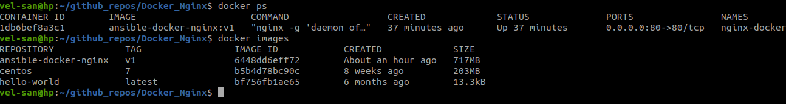
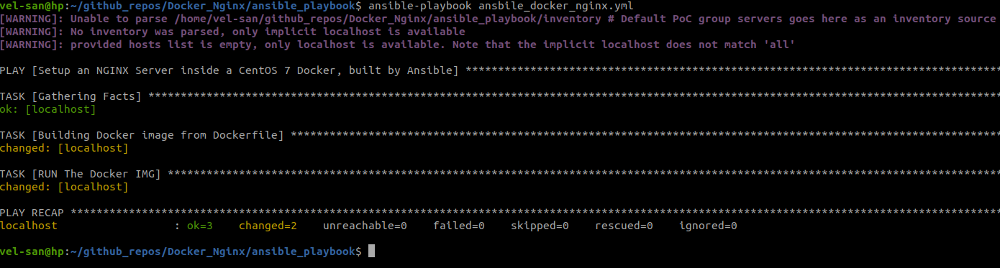

- [Docker_Nginx](#docker_nginx)
  - [Building](#building)
  - [Running](#running)
  - [Test NGINX Server](#test-nginx-server)
  - [Quick Docker Commands](#quick-docker-commands)
- [Ansible Commands](#ansible-commands)
  - [Testing local connection](#testing-local-connection)
  - [Running the play-book](#running-the-play-book)
  - [Play-book notes](#play-book-notes)
  - [Ansible Enviroment](#ansible-enviroment)
  - [Issues Faced](#issues-faced)
  - [PoC pictures](#poc-pictures)
    - [Docker Image & Container](#docker-image--container)
    - [NGINX html page](#nginx-html-page)
    - [Ansible playbook log](#ansible-playbook-log)

# Docker_Nginx

Build an Ngix server inside a docker

## Building

To build the image, simply run

```bash
docker build -t <img_name> .
```

## Running

To run the images in containers, simply do

```bash
docker run -d -it -p 80:80 -v $PWD:/data/www nginx-docker:latest
```

## Test NGINX Server

Either

> curl http://localhost

or in your browser

> localhost

## Quick Docker Commands

- Shut down and remove all containers
  - > docker stop $(docker ps -a -q)
  - > docker rm $(docker ps -a -q)

- Read Logs
  - > docker logs --follow <name>

# Ansible Commands

## Testing local connection

Create our PoC server groups, which for this example will include localhost only (Even tho we can ping without creating this)

```bash
cd ansible_playbook
touch inventory
nano inventory
# Add the following section
[PoC]
localhost
127.0.0.1
```

And run

> run ansible PoC -m ping

or

Run the following, and it should give you a SUCCESS request

> ansible localhost -m ping

Outputs

```text
localhost | SUCCESS => {
    "changed": false,
    "ping": "pong"
}
```

## Running the play-book

Requirements:
Since we're using python3.8+ , install pip3 and run the following:
- > pip3 install docker-py

Now you can start the playbook. Run the following inside the directory `ansible_playbook`

> ansible-playbook ansbile_docker_nginx.yml

## Play-book notes

- Since we can't use `docker` module along with `docker_image`, We'll be using docker_image for now along with the `docker-py` python module (Unfortunately this is depricated now, but we're using it here just for a PoC)

> docker_image parameters can be found [HERE](https://docs.ansible.com/ansible/latest/modules/docker_image_module.html)

- To run the image, we'll be using docker_container

> docker_container parameters can be found [HERE](https://docs.ansible.com/ansible/latest/modules/docker_container_module.html)

- You can change the image name, tag and contaienr name from `ansible_docker_nginx.yml` variables

## Ansible Enviroment

- OS: Ubuntu 20.04 LTS x86_64

- Install Ansible using

> sudo apt install ansible

This will install the needed python by itself (3.8+)

- Install docker using

> sudo apt install docker.io

## Issues Faced

Using docker module didn't work, rather, it always gave dependancy errors and the ports weren't being forwarded correctly. The module is very old and depricated so it's not recommended to use anyway

## PoC pictures

### Docker Image & Container



### NGINX html page


### Ansible playbook log

